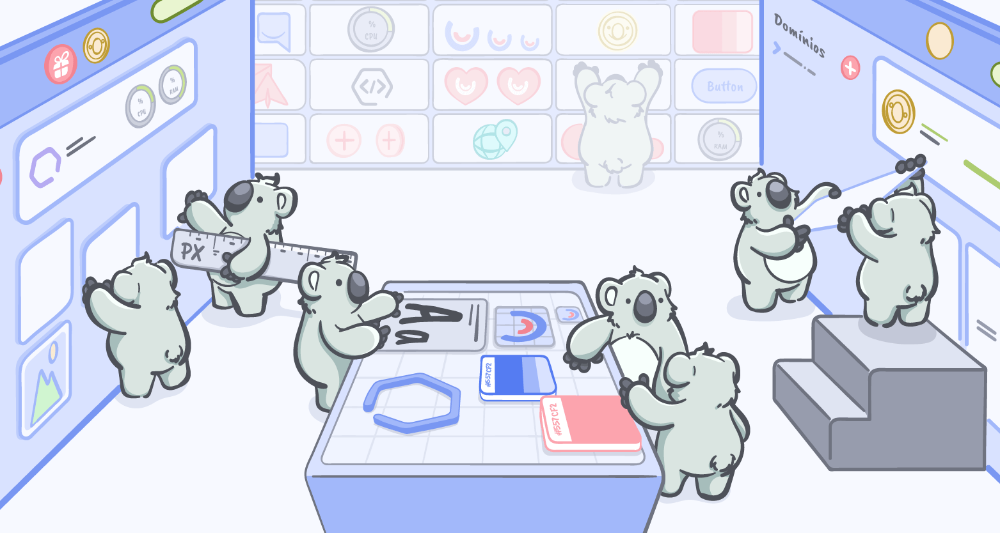

<h1 align="center">CatálogoApp</h1>

Índice
=================
<!--ts-->
   * [Sobre o projeto](#💻-sobre-o-projeto)
   * [Layout](#🎨-layout)
   * [Funcionalidades do projeto](#🔨-funcionalidades-do-projeto)
   * [Como iniciar o projeto](#🚀-como-iniciar-o-projeto)
   * [Ferramentas externas utilizadas](#⚙️-ferramentas-externas-utilizadas)
   * [Sugestões](#💡-sugestões)
<!--te-->

💻 Sobre o projeto
===========

A aplicação é um catálogo de produtos para lojas onde o usuário consegue ver os produtos disponíveis do estabelecimento, adicionar em seu carrinho ou remover algum produto que desejar e finalizar o seu pedido para a loja. 

🎨 Layout
============

O layout da aplicação está disponível no AdobeXD:

 

🔨 Funcionalidades do projeto
============

- [x] Listar produtos
- [x] Adicionar produtos no carrinho
- [x] Selecionar complementos do produto
- [x] Excluir produto do carrinho
- [x] Listar carrinho

🚀 Como iniciar o projeto
==================

Esse projeto foi iniciado com [Create React App](https://github.com/facebook/create-react-app).

É necessário criar um arquivo `.env` na raiz do projeto conforme o padrão do arquivo de exemplo `.env-example`, este que já possui a URL da API padrão utilizada durante o desenvolvimento.

## Scripts Disponíveis

No diretório do projeto, você pode rodar os seguintes scripts para iniciar o projeto (isto já com o npm instalado):

### `npm start`

Executa a aplicação em modo de desenvolvimento.\
Abrindo [http://localhost:3000](http://localhost:3000) para visualização no navegador.

A página irá atualizar automaticamente a cada alteração no código enquanto estiver executando no modo desenvolvimento.

⚙️ Ferramentas externas utilizadas
==================

- React Select: Se trata de uma lib de components Select, que neste caso foi usado para montar o multi-select com filtro que havia no layout.
> https://react-select.com/home

- Axios: É uma biblioteca popular responsável por facilitar a lógica de requisições HTTP. E foi utilizada para realizar as requisições para a API.
> https://axios-http.com/

- React Router: É uma popular biblioteca do React responsável por facilitar a lógica de rotas para os componentes, mantendo o comportamento de SPA.
> https://reactrouter.com/

💡 Sugestões
============

- `Cores menu e botão fechar`: 
    -
   - Ao abrir o **menu**, podemos perceber que o menu não possui um botão para fechar a aba e continuar navegando no app. O usuário pode não saber onde clicar para fechar a aba menu.
   - As cores do menu <b style="background-color:#31343B">"gray-darker"</b> e <b style="background-color:#5CB85C">"#5CB85C"</b> são bastante diferentes das cores padrões do aplicativo
    e acabam desviando muito do padrão. Acredito que deixando a cor de fundo <b style="background-color:#F7F9FF; color: #000">"#F7F9FF"</b> no menu e colocando uma sombra e o botão da cor <b style="background-color:#557CF2">"#557CF2"</b> já teria ficando melhor.
- `Alguns itens da api divergem do layout`:
    -
   - O endpoint de fazer pedido (apesar de não estar funcionando e acusar 404) não tinha previsto no "corpo" da requisição parâmetros para "observações do pedido", "nome do cliente do pedido".
   - No layout também estava previsto que o estabelecimento teria um preço de entrega e valor mínimo de pedido para ser exibido (como aparece na tela 3 e 4, que seriam o carrinho e  finalizar pedido respectivamente), mas nenhum dos endpoints retorna tal informação.
   - O endpoint "https://apiprodutosutalk.herokuapp.com/produtos" retorna algumas informações do estabelecimento também, mas onde deveria retornar a URL para a imagem de fundo do estabelecimento, acaba retornando o caminho para a imagem dentro do servidor.
- `Ter uma documentação da API`:
    -
    - Seria interessante ter uma documentação da API, algo como o swagger possibilita ou algo como tem na Umbler (https://api.umbler.com/docs/index.html). Assim possibilita ter uma ideia melhor do que é necessário enviar e o que é possível se receber deste endpoint em diferentes cenários.
- `Tempo`:
    -
    - Além disso, talvez seria interessante um pouco mais de tempo também, talvez uma semana a mais. Pois se a ideia seria também estimular a conhecer essas ferramentas além do mínimo no desafio, ficou pouco tempo para procurar e explorar as questões que estão como "bônus". 